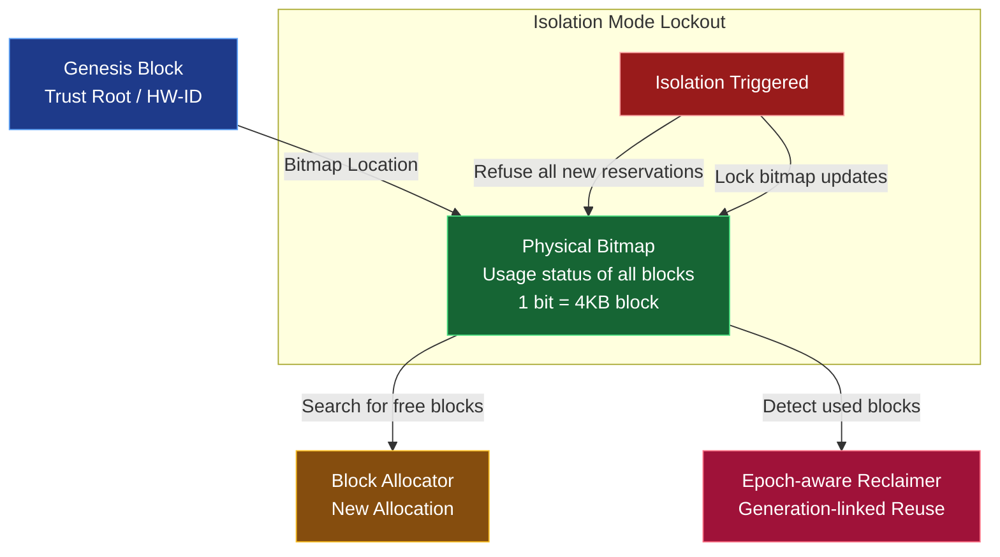

# TUFF-FS Free Space Management (Allocator) Detailed Specification

## 1. Overview

Free space management in TUFF-FS is more than just "finding empty blocks"; it is an intelligent timeline management mechanism designed to **"physically protect the history of J-Generations while safely rotating the reuse cycle."**

The system consists of a two-layered structure:

- **Physical Bitmap**: Manages the usage status of physical blocks (4KB units) using 1 bit per block.
- **Epoch-aware Reclaim**: Safe reuse processing linked with J-Generation (Epochs).

This ensures complete separation and protection of **N-Redundancy areas** (immediate commitment type) and **J-Generation areas** (generation-managed type).

## 2. Physical Bitmap

A 1-bit flag is assigned to every 4KB block across the entire storage to record its usage status.

- **Placement**: Stored in the reserved area of the Genesis block (fixed offset).
- **Size**: Approximately 3MB per 1TB of storage (1 block = 1 bit).
- **Update Timing**:
  - Block Allocation: Immediate 1 → 0 (In Use).
  - Block Release: Immediate 0 → 1 (Free).
- **Protection**: The entire bitmap is physically locked (updates prohibited) upon Isolation Mode trigger.



## 3. Separation of N-Redundancy and J-Generation

TUFF-FS clearly separates **Immediate Commitment (N-Redundancy)** and **Generational Management (J-Generation)**.

```mermaid
flowchart LR
    subgraph "N-Redundancy Area (Immediate)"
        N1[Start Write] --> N2[Simultaneous write to multiple disks\n(1-3 replicas)]
        N2 --> N3[Commit / Reject\nPointer replacement only]
        N3 --> N4[Immediate Commitment\nNo Rollback]
    end

    subgraph "J-Generation Area (Generational)"
        J1[Start Write] --> J2[Write to new LBA\nOld LBA is preserved]
        J2 --> J3[Epoch Increment\nMetadata Update]
        J3 --> J4[Rollback Possible\nRestore past state via pointer switch]
    end

    N1 ~~~ J1  %% Visual separator line

    classDef n fill:#1e40af,color:#fff,stroke:#60a5fa
    classDef j fill:#854d0e,color:#fff,stroke:#fbbf24

    class N1,N2,N3,N4 n
    class J1,J2,J3,J4 j
```

### Reasons and Benefits of Separation

- **N-Redundancy Area**
  - Priority on immediacy (DB logs, config files, etc.).
  - Super fast due to pointer-only replacement on Commit/Reject.
  - No Rollback → Guarantees data persistence.

- **J-Generation Area**
  - Priority on history protection (user docs, project folders, etc.).
  - Generational management via new LBA writes + pointer switching.
  - Instant past-state restoration via Rollback → Ransomware countermeasure.

This separation realizes both **immediacy and history protection** simultaneously.

## 4. Epoch-aware Reclaim

A mechanism to safely reuse blocks from older generations.

1. **Candidate Selection**:
   - Identify blocks no longer referenced by older Epochs (generations).
   - Verify the "In Use" flag is not set in the Bitmap.

2. **Cross-Check**:
   - Reverse-lookup pointers in the Metadata Chunk.
   - Detect and repair "dangling" blocks or double allocations.

3. **Reuse**:
   - Update Bitmap to "Free" after safety confirmation.
   - Available for new allocations.

**In Isolation Mode**:
- Refuses all new reservations.
- Physically locks Bitmap updates (write-prohibited).

## 5. Key Implementation Points

- **Isolation Mode Lockout**: Locks the entire Bitmap upon Isolation trigger. Completely refuses new block allocations and stops reuse of existing blocks.
- **Dangling Block Auto-Repair**: Cross-checks Metadata Chunks and Bitmap during `fsck`. Automatically recovers dangling blocks.
- **J-Generation Protection**: Blocks from older generations are **never reused** until they are no longer referenced by the current Epoch (timeline protection).

## 6. Conclusion

The TUFF-FS allocator is an intelligent timeline management mechanism that **safely rotates the reuse cycle while physically protecting J-Generation history.**

- Physical Bitmap → Immediate usage management.
- Epoch-aware Reclaim → Generational protection and safe reuse.
- Isolation Lockout → Complete freeze during final defense.

Through this, TUFF-FS achieves **speed, security, and fault tolerance** simultaneously.
