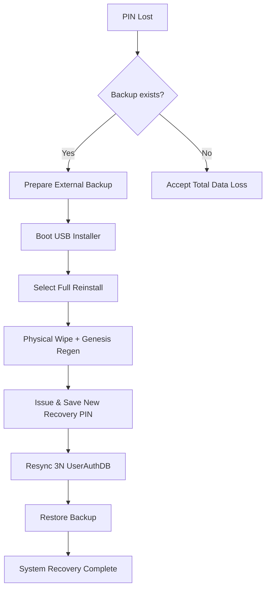

# TUFF-OS Isolation Mode: Recovery Procedure for Lost PIN (Complete Version)

If the Recovery PIN is lost, **all standard recovery paths are permanently closed**.
This is an intentional design choice based on the TUFF-OS principles of "**Rigorous Fail-Closed**" and "**Absolute Physical Sovereignty**," ensuring that no unauthorized third party (including attackers) can recover the system without the PIN.

### The Sole Recovery Method for PIN Loss

**"Complete Reinstallation (Total Data Deletion)"** is the only available option.
→ This is the only way to "**Physically Rebuild the Root of Trust**," and no workarounds exist.

#### Recovery Procedure (Step-by-Step)

**Estimated Duration**: Approx. 60–120 minutes (depending on storage initialization time).

1. **Preparation**
   - **Perform a full backup of critical data** to external storage (a separate drive outside of TUFF-OS) beforehand.
   - Prepare an installation USB drive (or ISO). Re-downloading the latest version is recommended.
   - Ensure all physical HDDs are connected (minimum 3, recommended 5).

2. **Boot the Installer**
   - Boot the host PC from the USB installer.
   - Set "TUFF-OS Installer" as the highest priority in BIOS/UEFI.

3. **Select Reinstallation**
   - After the installer starts, select "**Complete Reinstallation (Total Data Wipe)**."
   - A **Warning Dialog** will appear twice. Type "**YES, I UNDERSTAND**" to proceed.
   - Reselect the target disks (SSD + all HDDs).

4. **Genesis Re-initialization**
   - Generate a new HW-ID (based on the current physical disk configuration).
   - A new Recovery PIN is automatically generated → **Displayed on screen** + **Encrypted and saved to the USB drive**. (Make sure to record this).
   - Sync-write the new 3N UserAuthDB to three separate disks.

5. **TUFF-FS Reconstruction**
   - Perform initial formatting of all HDDs (Physical Zero-fill recommended).
   - Re-apply UQ/HW queues, Emergency Areas, and N-Redundancy/J-Generation settings.
   - Restore data from backup (Optional).

6. **Post-Completion Verification**
   - Reboot → Normal boot with the new Genesis.
   - Run `tuffutl sys status` to verify "Genesis: Valid" and "Isolation: Inactive."
   - Create a new user → Log in → Restore backup data.

### Recovery Flowchart for PIN Loss (Simplified)

### Critical Warnings and Operational Notes

- **Never lose the PIN**
  - Immediately after installation, **write it on paper and store it in a safe**, or use an **offline password manager**.
  - For multi-person management, **Shamir's Secret Sharing** (threshold cryptography) is recommended.

- **Reinstallation is the Last Resort**
  - All data is physically erased.
  - Without a backup, this results in **total loss**.

- **Preventative Measures (Highly Recommended)**
  - Conduct a **Test Isolation Drill** immediately after the initial installation (trigger → recover).
  - **Safe Distributed Storage**: Save the PIN in multiple secure locations (e.g., a safe + a trusted third party).
  - Periodically verify PIN operation using `tuffutl sys isolation recover --test`.

PIN loss is designed to make recovery extremely difficult, following the "**Intentional Design of TUFF-OS**." This prevents attackers from seizing the system even if they obtain the PIN.

**Summary**
- PIN Lost → **Reinstall (Total Wipe)** is the only way.
- Prevention is everything → **Manage your PIN as if your life depends on it.**
