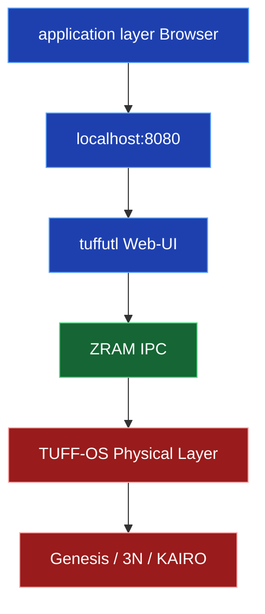
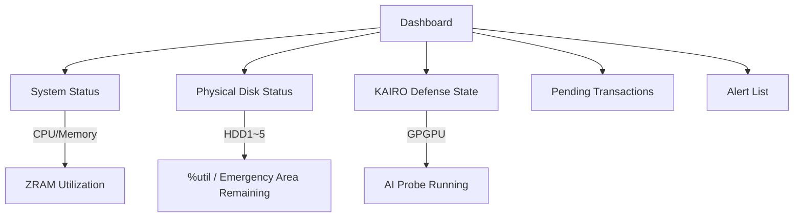

# Integrated Management Manager "tuffutl" User Reference (Upper Web-UI Edition)

**Last Updated**: March 22, 2026  
**Version**: 1.0 (Final Consensus Edition)

---

## 1. Overview

The **tuffutl Web-UI** is a **local-only browser interface** designed for intuitively operating TUFF-OS from an application layer (Windows / TUFF-KERNEL / macOS).

- **Design Philosophy**: Visualize the physical layer state while **preventing any direct access from the application layer**.
- **Operation**: A local server (`tuffwin` / `tufflnx` / `tuffmac`) runs on the application layer, and the UI is accessed via a browser at `127.0.0.1:8080`.
- **Security**: Completely inaccessible from external networks (localhost only). All communication is encrypted via KEY-CSE.

---

## 2. Access and Authentication

### 2.1 How to Access
Access the following URL in your application layer browser:

**URL**: `http://127.0.0.1:8080/`  
(Port numbers may vary depending on the environment).

### 2.2 Login Screen

- **User ID**: A unique TUFF-OS ID (separate from your application layer username).
- **Password**: A secure password of at least 12 characters.

**Upon Successful Login**  
A 128-bit Session ID is deployed to ZRAM, granting permission for subsequent operations.

**Caution**: If **three consecutive** failed login attempts occur, the system will **immediately transition to Isolation Mode**, and the screen will stop responding.

---

## 3. Dashboard

The main screen displayed immediately after logging in.

**Key Display Items**
- System Load (CPU / ZRAM / UQ Congestion Rate).
- `%util` and Emergency Area usage for each physical HDD.
- KAIRO Defense Status (Silent Drop count / GPGPU activity).
- Critical Alerts (3N repair events, Isolation transition warnings, etc.).

---

## 4. File System Management (TUFF-FS)

Operate N-Redundancy, J-Generation, and Tag permissions per directory via the GUI.

### 4.1 N-Redundancy Settings
Select a directory → Choose 1–3 in the "N-Redundancy" panel → **Apply**.

### 4.2 J-Generation Rollback
- Select the target folder → "History" tab.
- Preview past Epochs → Click the **Rollback** button for instant restoration.

### 4.3 TagGroupMask Configuration
- Create Tags (e.g., "Confidential", "Finance").
- Assign Read/Write permissions per user via checkboxes.

---

## 5. Network Defense Management (KAIRO)

### 5.1 KAIRO Status
- Use toggle switches to switch between "Defense Enabled / Monitor Only / Total Blockade".
- Real-time display of GPGPU offload status.

### 5.2 Blacklist / AI Server List
- Add or remove malicious IPs.
- Register authorized AI server URLs (Password authentication required).

**Important**: While this screen is open, **AI agent communication is automatically suspended** for safety.

---

## 6. Account & Privilege Management

- **Add User / Reset Password**.
- **Bulk Edit TagGroupMask** (Administrators only).

---

## 7. Audit Logs (Witness Logs)

- Log viewer with filters.
- Each log displays a **green PQC-signature valid mark**.
- Automatic warnings upon tampering detection.

---

## 8. Ending a Session

- Click the **[Logout]** button in the top right.
- Or close the browser tab.
- Upon logout, session info on ZRAM is **immediately Zeroized via AVX2/AVX-512**.

---

**Operational Tips**
- The Web-UI is **localhost only** (No external access).
- All operations are relayed to `tuffutl` commands and executed at the physical layer.
- Anomaly detection triggers an automatic transition to Isolation Mode, prioritizing safety.
