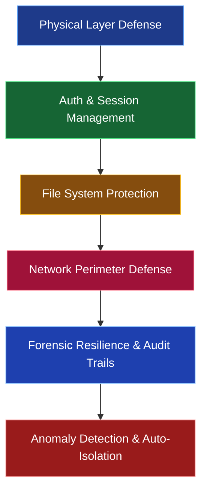

# TUFF-OS Security Features List

The following is a comprehensive summary of the **security features** of TUFF-OS, including technical details. This list is organized for both users and administrators based on the current implementation (as of March 2026).

### Security Feature Overview (Holistic View)

---

### 1. Physical Layer Defense (The Most Robust Foundation)

| Feature | Detailed Description | Resistance Level |
|:---|:---|:---|
| **Genesis Block** | The root of trust for the system. Imprints HW-ID at specific LBAs. Invalidates disks if removed from the host. | Physical removal completely neutralized. |
| **3N Majority Redundancy** | Critical data like UserAuthDB is synchronized across 3 disks. Auto-repairs upon 2/3 agreement at boot. | Resilient up to 1 disk total failure. |
| **LBA Phase Binding** | All I/O is issued directly to physical LBAs. Renders logical address tampering impossible. | Logical attacks completely neutralized. |
| **Read Deception** | Returns "consistent meaningless noise" generated via ChaCha20 + AVX2 parallelization to unauthenticated `dd` attempts. | Data existence completely hidden. |
| **Write Silent Success** | Spoofs "Success" for unauthenticated writes while actually dropping the data (Attackers notice nothing). | Tampering attempts effectively neutralized. |

### 2. Authentication & Session Management

| Feature | Detailed Description | Resistance Level |
|:---|:---|:---|
| **Argon2id + SIMD Acceleration** | Uses Argon2id (t=3, m=64MiB, p=4) for password hashing. Takes ~400ms on Ryzen 5700G. | GPU Brute-force resistance (Years to decades). |
| **TagGroupMask** | Manages 380 tag permissions per user using 2 bits each. High-speed evaluation via bitwise logic. | Unauthorized folder existence hidden (ENOENT spoofing). |
| **Zero-Allocation Waker** | Session management avoids heap usage via static allocation. Immediate Zeroization (AVX2/512) upon Isolation. | Zero memory residue. |
| **Isolation Mode** | Immediate transition upon 3 consecutive forged token detections. Wipes ZRAM and blocks all I/O. Persists across reboots. | Immediate neutralization of impersonation. |

### 3. File System Protection (TUFF-FS)

| Feature | Detailed Description | Resistance Level |
|:---|:---|:---|
| **N-Redundancy** | 1–3x replication per folder. Atomic finalization via Commit/Reject. | Ransomware resistance. |
| **J-Generation (Epoch)** | Writes to new LBAs for every update. Instant rollback via index pointer switching. | Past generations restored in milliseconds. |
| **UQ + HW Queues** | Aggregated writes + optimal HDD dynamic selection. Back-pressure blocks I/O when >80% capacity is reached. | Disk-full protection. |
| **Emergency Area** | Consistently reserves 10% of all HDDs. Enables auto-evacuation and non-stop re-sync during failure. | Resilient to disk dropouts. |

### 4. Network Perimeter Defense (KAIRO)

| Feature | Detailed Description | Resistance Level |
|:---|:---|:---|
| **eBPF LSM/XDP** | Kernel-layer packet monitoring. Silent Drops unauthorized traffic before it reaches the OS stack. | L3–L7 total blockade. |
| **Vulkan GPGPU Offload** | Completely offloads AI Probe / IDPI to iGPU. Sustains 10Gbps load at 0.0% CPU usage. | Large-scale DDoS neutralized. |
| **PQC Signature Audit** | All discarded packets are recorded with MlDsa-44 quantum-resistant signatures + hash chains. | Audit trails are tamper-proof. |
| **Bulk Signing** | Batch-signs 4096 events under high load. Eliminates signature bottlenecks for 10Gbps traffic. | Real-time high-throughput support. |

### 5. Forensic Resilience & Zero-Trace Design

| Feature | Detailed Description | Verification Status |
|:---|:---|:---|
| **Bulk Secret Zeroize** | Session keys, TagGroupMask, and Wakers are immediately wiped using AVX2/512. | 0 hits in 4GB memory dump analysis. |
| **Physical Agnosticism** | `dd` on unauthenticated disks returns zero meaningful data (ChaCha20 noise). | Confirmed via E2E testing. |
| **PQC Audit Trails** | All discard/anomaly events recorded with quantum-resistant signatures. Tamper-detection enabled. | Hash chain verified. |
| **Persistent Isolation** | Flag passed from UEFI to Kernel. Rejects all access even after a malicious reboot. | Confirmed via reboot stress test. |

---

### Summary: The Three Pillars of TUFF-OS Security

1. **Direct Physical Layer Linkage** → Neutralizes logical attacks (Genesis / 3N / LBA Binding).
2. **Asynchronous Zero-Copy** → Prevents CPU monopolization even under extreme load (Waker / GPGPU / Zeroize).
3. **Agnosticism + Fail-Closed** → Hides existence + isolates anomalies immediately (Deception / Isolation / KAIRO).

TUFF-OS functions as the **ultimate data sovereignty platform in the era of AI agents.**
