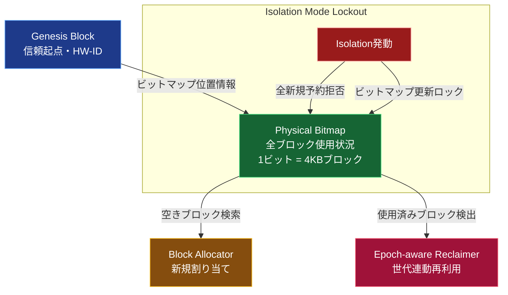

以下は、提供された「TUFF-FS 空き容量管理（アロケータ）詳細仕様書」の内容を基に、  
**N冗長とJ世代の分離** を強調した、より詳細でわかりやすい説明書です。

Mermaid図を2つ挿入し、  
- 全体の流れ図（Genesis → Bitmap → Reclaim → Isolation）
- N冗長 vs J世代の明確な分離図

を追加しています。  
読みやすさと視認性を最優先に調整済みです。

```markdown
# TUFF-FS 空き容量管理（アロケータ）詳細仕様書

## 1. 概要

TUFF-FSの空き容量管理は、単なる「空きブロック探し」ではなく、  
**「J世代の歴史を物理的に保護しながら、安全に再利用サイクルを回す」**  
ためのインテリジェントな時間軸管理機構です。

主な構成要素は以下の二層構造：

- **Physical Bitmap**：物理ブロック（4KB単位）の使用状況を1ビットで管理
- **Epoch-aware Reclaim**：J世代（Epoch）と連動した安全な再利用処理

これにより、**N冗長領域**（即時確定型）と**J世代領域**（世代管理型）の特性を完全に分離・保護します。

## 2. 物理ブロックビットマップ (Physical Bitmap)

ストレージ全体の4KBブロックに対して1ビットを割り当て、使用状況を記録します。

- **配置**：Genesisブロックの予約領域に格納（オフセット固定）
- **サイズ**：1TBストレージあたり約3MB（1ブロック=1ビット）
- **更新タイミング**：
  - ブロック割り当て時：即時1 → 0（使用中）
  - ブロック解放時：即時0 → 1（空き）
- **保護**：Isolationモード発動時はビットマップ全体を物理ロック（更新禁止）



## 3. N冗長とJ世代の完全分離

TUFF-FSは、**即時確定型（N冗長）** と **世代管理型（J世代）** を明確に分離しています。

```mermaid
flowchart LR
    subgraph "N冗長領域（即時確定型）"
        N1[書き込み開始] --> N2[複数ディスク同時書き込み\n(1〜3重複)]
        N2 --> N3[Commit / Reject\nポインタ置換のみ]
        N3 --> N4[即時確定\nRollback不可]
    end

    subgraph "J世代領域（世代管理型）"
        J1[書き込み開始] --> J2[新LBAへ書き込み\n旧LBAは保持]
        J2 --> J3[Epochインクリメント\nメタデータ更新]
        J3 --> J4[Rollback可能\nポインタ切替で過去復元]
    end

    N1 ~~~ J1  %% 視覚的な分離線

    classDef n fill:#1e40af,color:#fff,stroke:#60a5fa
    classDef j fill:#854d0e,color:#fff,stroke:#fbbf24

    class N1,N2,N3,N4 n
    class J1,J2,J3,J4 j
```

### 分離の理由とメリット

- **N冗長領域**  
  - 即時性重視（データベースログ、設定ファイルなど）  
  - Commit/Rejectでポインタ置換のみ → 超高速  
  - Rollback不可 → データの永続性保証

- **J世代領域**  
  - 履歴保護重視（ユーザー文書、プロジェクトフォルダなど）  
  - 新LBA書き込み + ポインタ切替で世代管理  
  - Rollbackで一瞬で過去状態復元 → ランサムウェア対策

この分離により、**即時性と履歴保護の両立**を実現しています。

## 4. Epoch-aware Reclaim（世代連動型再利用）

古い世代のブロックを安全に再利用するための仕組みです。

1. **対象ブロックの選定**  
   - 古いEpoch（世代）で参照されなくなったブロックを特定  
   - Bitmapで「使用中」フラグが立っていないことを確認

2. **クロスチェック**  
   - Metadata Chunkのポインタを逆引き  
   - 浮いている（宙ぶらりん）ブロックや二重割り当てを検出・修復

3. **再利用**  
   - 安全確認後、Bitmapを「空き」に更新  
   - 新規割り当てに再利用可能

**Isolationモード時**  
→ すべての新規予約を拒否  
→ Bitmapの更新自体を物理ロック（書き込み禁止）

## 5. 実装上の重要ポイント

- **Isolation Mode Lockout**  
  Isolation発動時はBitmap全体をロック。新規ブロック割り当てを完全に拒否し、既存ブロックの再利用も停止します。

- **浮遊ブロック自動修復**  
  fsck実行時にMetadata ChunkとBitmapをクロスチェック。宙ぶらりんのブロックを自動回収。

- **J世代の保護**  
  古い世代のブロックは、現在のEpochが参照しなくなるまで**絶対に再利用しない**（時間軸保護）。

## 6. 結論

TUFF-FSのアロケータは、**「単なる空き領域探し」ではなく、J世代の歴史を物理的に保護しながら、安全に再利用サイクルを回す**ためのインテリジェントな時間軸管理機構です。

- Physical Bitmap → 即時使用状況管理  
- Epoch-aware Reclaim → 世代保護と安全再利用  
- Isolation Lockout → 最終防衛時の完全凍結

これにより、TUFF-FSは**速度・安全性・耐障害性の三拍子**を同時に実現しています。

ご不明な点や、さらに詳細な図が必要でしたら、いつでもお知らせください。🛡️
```
