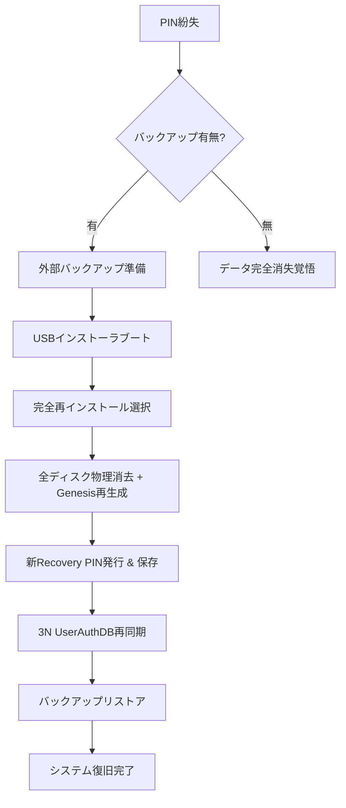

**TUFF-OS Isolationモード PIN紛失時の復旧手順（完全版）**

Recovery PINを紛失した場合、**通常の復帰経路は完全に閉ざされます**。  
これはTUFF-OSの設計思想である「**Fail-Closedの徹底**」と「**物理的主権の絶対性**」によるもので、PINを知らない第三者（攻撃者含む）がシステムを復旧できないよう意図的に制限されています。

### PIN紛失時の唯一の復帰手段

**「再インストール（全データ消去）」**のみが可能です。  
→ これは「**物理的に信頼の起点を再構築**」する唯一の方法であり、他の回避策は存在しません。

#### 復旧手順（ステップ・バイ・ステップ）

**所要時間目安**：約60〜120分（ストレージ初期化時間による）

1. **準備**
   - 重要なデータは**事前に外部ストレージへ完全バックアップ**（TUFF-OS外の別ドライブ）
   - インストール用USBメモリ（またはISO）を準備（最新版を再ダウンロード推奨）
   - 物理HDDをすべて接続した状態にする（最低3台、推奨5台）

2. **インストーラブート**
   - ホストPCをUSBインストーラからブート  
   - BIOS/UEFIで「TUFF-OS Installer」を最優先に設定

3. **再インストール選択**
   - インストーラ起動後、「**完全再インストール（データ全消去）**」を選択
   - **警告ダイアログ**（2回確認）が出るので、**「はい、理解しました」** を入力
   - 対象ディスクを再選択（SSD + HDD全台）

4. **Genesis再初期化**
   - 新しいHW-IDを生成（現在の物理ディスク構成に基づく）
   - 新しいRecovery PINを自動生成 → **画面に表示** + **USBメモリへ暗号保存**（必ず控える）
   - 3N UserAuthDBを新たに3ディスクへ同期書き込み

5. **TUFF-FS再構築**
   - 全HDDを初期フォーマット（物理ゼロフィル推奨）
   - UQ/HWキュー、避難領域、N冗長/J世代設定を再適用
   - バックアップからデータをリストア（任意）

6. **完了後の確認**
   - 再起動 → 新しいGenesisで正常ブート
   - `tuffutl sys status` で「Genesis: Valid」「Isolation: Inactive」を確認
   - 新規ユーザー作成 → ログイン → バックアップデータ復元

### PIN紛失時の復旧フロー図（簡易版）

### 重要警告と運用上の注意

- **PINは絶対に紛失しない**  
  → インストール直後に**紙に書いて金庫保管**、または**オフラインのパスワードマネージャ**に保存  
  → 複数人で管理する場合は**分割暗号**（Shamir's Secret Sharing）推奨

- **再インストールは最終手段**  
  → すべてのデータが物理的に消去される  
  → バックアップがなければ**完全喪失**となる

- **予防策（強く推奨）**
  - 初回インストール後すぐに**テスト用Isolation訓練**を実施（trigger → recover）
  - PINを**複数箇所に安全分散保存**（金庫 + 信頼できる第三者預かりなど）
  - 定期的に `tuffutl sys isolation recover --test` でPIN動作確認

PIN紛失は「**TUFF-OSの設計意図通り**」に復旧を極めて困難にする仕様です。  
これにより、攻撃者がPINを窃取した場合でもシステム奪取が不可能になります。

**まとめ**  
- PIN紛失 → **再インストール（全消去）** しか道なし  
- 予防がすべて → **PINは命より大切に管理**

