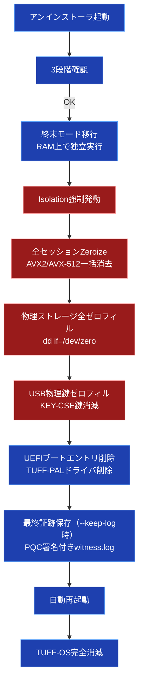
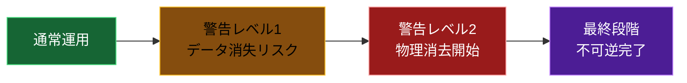

# TUFF-OS アンインストール手順書

**最終更新**: 2026年3月22日

**バージョン**: 1.0（最終確定版）

**【最重要警告】** この操作は**完全に不可逆**です。

TUFF-OSをアンインストールすると、以下のものが**物理的に復元不可能**になります：

- TUFF-FS内に保存された**すべてのファイル・データ**
    
- Genesisブロック / UserAuthDB / 避難領域
    
- すべてのセキュリティ証跡（一部を除く）
    
- 上位OSから見た仮想ドライブの痕跡
    

**バックアップをしていない場合、データは永久に失われます。** **実行前に必ず完全バックアップを取得してください。**

## アンインストールの全体フロー（図解）



## 危険度段階（目安）



## 実行手順（詳細ステップ）

### 事前準備（必須）

1. **完全バックアップ取得**（TUFF-OS外へ）
    
    ```
    tuffutl backup create --target / --output /mnt/external/full_backup_$(date +%Y%m%d).tar.zst --encrypt --verify
    ```
    
    → バックアップ先は**TUFF-OS外**の外部ストレージ
    
2. **アンインストーラの入手**
    
    - USBメモリに `tuff-uninstaller` をコピー（ビルド済みバイナリ）
        
    - 権限設定：`chmod +x tuff-uninstaller`
        

### 実行手順

1. **管理者権限で起動**
    
    ```
    sudo ./tuff-uninstaller
    ```
    
2. **第1段階確認（警告1）**
    
    ```
    【警告レベル1】
    TUFF-OSを完全にアンインストールします。
    すべてのデータ・設定・証跡が永久に消去されます。
    復旧不可能です。本当に続行しますか？ (yes/NO)
    ```
    
    → 「yes」と入力（小文字のみ）
    
3. **第2段階確認（最終文字列入力）**
    
    ```
    【警告レベル2】
    本当に削除しますか？
    「TUFF-OS完全削除」と入力してください。
    ```
    
    → 正確に入力（大文字小文字区別あり）
    
4. **第3段階確認（バックアップ再確認）**
    
    ```
    【最終確認】
    バックアップを作成済みですか？ (yes/no)
    ```
    
    → 「yes」のみ続行（「no」なら即終了）
    
5. **終末モード移行（自動）**
    
    - 自身をRAMディスク（/tmp/tuff-uninstaller-terminal）にコピー
        
    - 元プロセスを終了 → RAM上で再起動
        
    - これ以降、Isolationロックの影響を受けずに処理継続
        
6. **物理消去フェーズ（自動実行）**
    
    - 全セッション即時Zeroize（AVX2/AVX-512）
        
    - Isolation強制発動
        
    - 対象HDD全領域ゼロフィル（dd if=/dev/zero）
        
    - USBメモリ（KEY-CSE鍵領域）を自動検出 → 全体ゼロフィル
        
    - UEFIエントリ削除（efibootmgr）
        
    - TUFF-PALドライバ削除（sc delete / rmmod）
        
7. **最終証跡保存（--keep-log指定時のみ）**
    
    - witness.log最終部分をMlDsa-44署名
        
    - 外部USB（/mnt/usb/final_evidence.log）へ保存
        
    - 本体ログファイルをゼロフィル
        
8. **完了処理**
    
    - 「TUFF-OSは完全に消滅しました。再起動してください。」
        
    - 自動で`reboot`実行（中断不可）
        

### オプション一覧

|オプション|意味|デフォルト|
|---|---|---|
|`--keep-log`|最終証跡をPQC署名付きで外部保存|なし|
|`--no-terminal`|RAM終末モードを無効化（危険・非推奨）|無効|
|`--log-dest <path>`|証跡保存先（例: /mnt/usb/final.log）|自動検出|
|`--dry-run`|実行せずシミュレーションのみ|なし|

### 特殊ケース対応

|ケース|対応方法|注意|
|---|---|---|
|ブート不能時|USBインストーラの「Uninstallモード」起動 → 全ディスクゼロフィル|PIN不要|
|PIN紛失時|上記手順そのまま実行|データ全消去確定|
|上位OSに残存ドライバ|Windows: デバイスマネージャーからTUFF-PAL削除<br><br>TUFF-KERNEL: rmmod & rm -rf|再起動必須|
|ログを残したい|`--keep-log --log-dest /mnt/usb/final.log`|PQC署名付き保存|

**最後の言葉** TUFF-OSは「**生まれた時と同じく、無から現れ、無に帰る**」ことを許すシステムです。

アンインストールは、その哲学の最終章です。

**実行前に必ずバックアップを。** そして、**覚悟を持って**ボタンを押してください。