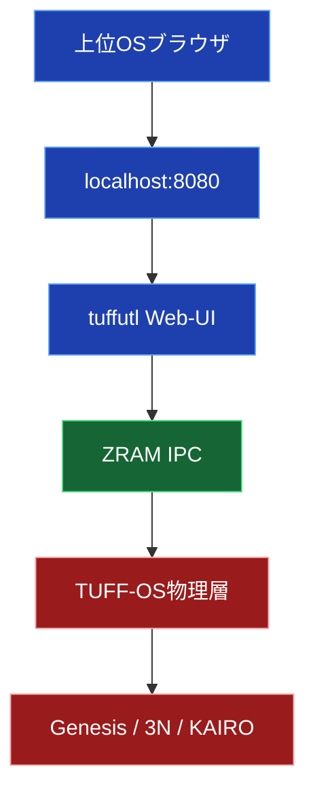
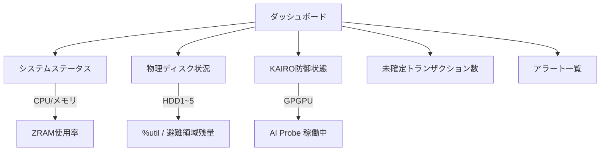

**TUFF-OS 統合管理マネージャ「tuffutl」ユーザリファレンス（上位Web-UI版）**

**最終更新**: 2026年3月22日  
**バージョン**: 1.0（最終確定版）

---

## 1. 概要

**tuffutl Web-UI** は、上位OS（Windows / TUFF-KERNEL / macOS）からTUFF-OSを直感的に操作するための**ローカル専用ブラウザインターフェース**です。

- **設計思想**: 物理層の状態を可視化しつつ、**上位OSからは一切直接触れさせない**  
- **動作方式**: 上位OS上でローカルサーバー（`tuffwin` / `tufflnx` / `tuffmac`）が起動し、ブラウザから `127.0.0.1:8080` にアクセス  
- **セキュリティ**: 外部ネットワークからは一切アクセス不可（localhost限定）。通信はすべてKEY-CSEで暗号化

---

## 2. アクセスと認証

### 2.1 アクセス方法
上位OSのブラウザで以下にアクセスしてください。

**URL**: `http://127.0.0.1:8080/`  
（ポート番号は環境により異なる場合があります）

### 2.2 ログイン画面

- **ユーザーID**: TUFF-OS独自のID（上位OSのユーザー名とは別）
- **パスワード**: 12桁以上のセキュアパスワード

**ログイン成功後**  
128-bit Session ID がZRAMに展開され、以降の操作が許可されます。

**注意**: 不正ログイン試行が**3回連続**で発生すると、**即座にIsolationモード**に移行し、画面は応答しなくなります。

---

## 3. ダッシュボード画面

ログイン直後に表示されるメイン画面です。

**主な表示項目**
- システム負荷（CPU / ZRAM / UQ滞留率）
- 各物理HDDの `%util` と避難領域使用率
- KAIROの防御状態（Silent Drop数 / GPGPU稼働状況）
- 重大アラート（3N修復イベント、Isolation移行警告など）

---

## 4. ファイルシステム管理（TUFF-FS）

ディレクトリ単位でN冗長・J世代・タグ権限をGUIで操作できます。

### 4.1 N冗長設定
ディレクトリを選択 → 「N冗長」パネルで1〜3を選択 → **適用**

### 4.2 J世代ロールバック
- 対象フォルダを選択 → 「履歴」タブ
- 過去のEpochをプレビュー → **ロールバック**ボタンで即時復元

### 4.3 TagGroupMask設定
- タグ（「社外秘」「財務」など）を作成
- ユーザーごとに読み取り/書き込み権限をチェックボックスで付与

---

## 5. ネットワーク防衛管理（KAIRO）

### 5.1 KAIROステータス
- トグルスイッチで「防御有効 / 監視のみ / 完全遮断」を切り替え
- GPGPUオフロード状態をリアルタイム表示

### 5.2 ブラックリスト / AIサーバリスト
- 悪意IPの追加・削除
- 許可AIサーバの登録（パスワード認証）

**重要**: この画面を開いている間、**AIエージェント通信は自動的に一時遮断**されます（安全設計）。

---

## 6. アカウント・権限管理

- **ユーザー追加 / パスワードリセット**
- **TagGroupMask一括編集**（管理者限定）

---

## 7. 証跡ログ確認（Witness Logs）

- フィルタ付きログビューア
- 各ログに**緑色のPQC署名有効マーク**が表示
- 改ざん検知時は自動で警告

---

## 8. セッション終了

- 右上 **[ログアウト]** ボタン
- またはブラウザタブを閉じる
- ログアウトと同時にZRAM上のセッション情報は**AVX2/AVX-512で即時Zeroize**されます

---

**ご利用のポイント**
- Web-UIは**localhost限定**です（外部アクセス不可）
- すべての操作は裏側で `tuffutl` コマンドに中継され、物理層で実行されます
- 異常検知時は自動でIsolationモードに移行し、安全を最優先します
