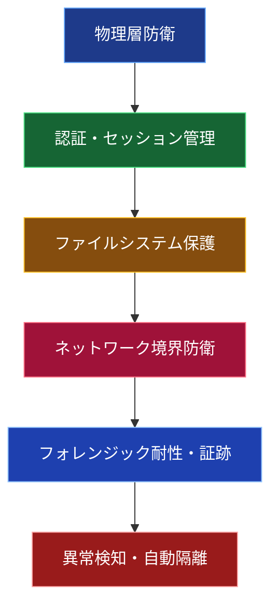

以下は、TUFF-OSの**セキュリティ機能**を、技術的詳細を含めてわかりやすくまとめた説明です。  
現在の実装（2026年3月時点）を基に、ユーザー・管理者向けに整理しています。

### TUFF-OS セキュリティ機能一覧（全体像）

### 1. 物理層防衛（最も強固な基盤）

| 機能                     | 詳細説明                                                                 | 攻撃耐性レベル |
|--------------------------|--------------------------------------------------------------------------|----------------|
| **Genesisブロック**      | システムの信頼起点。特定LBAにHW-IDを刻印。ディスク持ち出し無効化。      | 物理的持ち出し完全無効 |
| **3N多数決冗長**         | UserAuthDBなど重要データは3ディスクに同期。起動時2/3一致で自動修復。     | 1台破損まで自動耐性 |
| **LBA位相拘束**          | すべてのI/Oは物理LBAに直接発行。論理アドレス改ざん無効。               | 論理攻撃完全無効 |
| **Read Deception**       | 未認証ddに対し、ChaCha20 + AVX2並列生成の「一貫性のある無意味ノイズ」を返却 | データ存在秘匿 |
| **Write Silent Success** | 未認証書き込みは成功を偽装し、実際はドロップ（攻撃者に気づかせない）     | 改ざん試行無効化 |

### 2. 認証・セッション管理

| 機能                     | 詳細説明                                                                 | 攻撃耐性レベル |
|--------------------------|--------------------------------------------------------------------------|----------------|
| **Argon2id + SIMD高速化** | パスワードハッシュにArgon2id（t=3, m=64MiB, p=4）を使用。Ryzen 5700Gで約400ms | GPU総当たり耐性（数年〜十数年） |
| **TagGroupMask**         | ユーザーごとに380個のタグ権限を2bitで管理。ビット演算で高速判定。       | 権限外フォルダ存在秘匿（ENOENT偽装） |
| **ランタイム管理型セッション状態**| セッション管理は固定スロットで保持し、Isolation時に機密状態を迅速にZeroize（AVX2/512） | メモリ残渣ゼロ |
| **Isolationモード**      | 偽トークン3回検知で即移行。ZRAM全消去 + 全I/O遮断。再ブート後も持続。   | なりすまし即時無効化 |

### 3. ファイルシステム保護（TUFF-FS）

| 機能                     | 詳細説明                                                                 | 攻撃耐性レベル |
|--------------------------|--------------------------------------------------------------------------|----------------|
| **N冗長**                | フォルダ単位で1〜3重複製。コミット/リジェクトでアトミック確定。         | ランサムウェア耐性 |
| **J世代（Epoch）**       | 更新ごとに新LBAへ書き込み。インデックスポインタ切替で即時ロールバック。 | 過去世代一瞬復元 |
| **UQ + HWキュー**        | 書き込み集約 + 最適HDD動的選択。背圧制御で80%超え時にブロック。         | ディスクフル保護 |
| **避難領域**             | 全HDDの10%を常時確保。障害時自動退避・無停止再同期。                   | ディスク脱落耐性 |

### 4. ネットワーク境界防衛（KAIRO）

| 機能                     | 詳細説明                                                                 | 攻撃耐性レベル |
|--------------------------|--------------------------------------------------------------------------|----------------|
| **eBPF LSM/XDP**         | カーネル層でパケット監視。未承認通信をスタック到達前にSilent Drop。     | L3〜L7全遮断 |
| **Vulkan GPGPUオフロード** | AI Probe / IDPIをiGPUへ完全オフロード。CPU使用率0.0%で10Gbps攻撃耐性。 | 大規模DDoS無効化 |
| **PQC署名証跡**          | 破棄パケットすべてにML-DSA量子耐性署名 + ハッシュチェーン。            | 証跡改ざん不可能 |
| **Bulk Signing**         | 高負荷時4096件一括署名。署名ボトルネック解消。                         | 10Gbps級対応 |

### 5. フォレンジック耐性・痕跡ゼロ設計

| 機能                     | 詳細説明                                                                 | 実証状況 |
|--------------------------|--------------------------------------------------------------------------|----------|
| **全機密情報のZeroize**   | セッション鍵・TagGroupMask・WakerすべてAVX2/512で即時消去。           | 4GBダンプ解析で0ヒット |
| **物理不可知性**         | 未認証状態でddしても意味のあるデータゼロ（ChaCha20ノイズ）              | E2Eテストで確認 |
| **PQC証跡**              | すべての破棄・異常イベントを量子耐性署名で記録。改ざん検知可能。       | ハッシュチェーン検証済み |
| **Isolation持続**        | UEFIからカーネルへフラグ引き継ぎ。再ブート後も全アクセス拒否。           | 再起動テストで確認 |

### まとめ：TUFF-OSセキュリティの3本柱

1. **物理層直結** → 論理攻撃を無効化（Genesis / 3N / LBA拘束）
2. **非同期ゼロコピー** → 高負荷時もCPUを占有しない（Waker / GPGPU / Zeroize）
3. **不可知性＋Fail-Closed** → 存在秘匿＋異常即隔離（Deception / Isolation / KAIRO）

これにより、TUFF-OSは**AIエージェント時代における究極のデータ主権プラットフォーム**として機能します。
