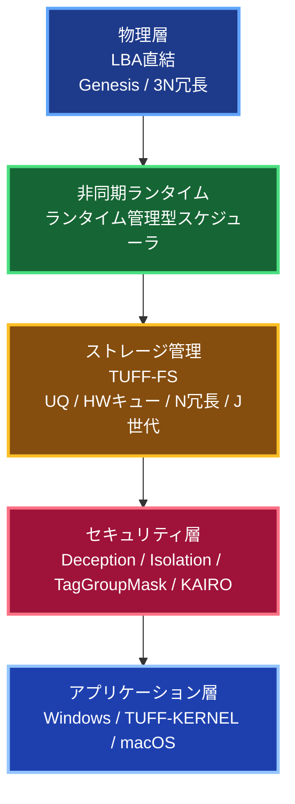
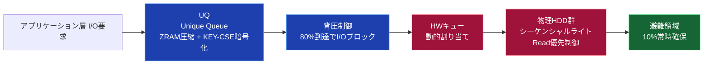
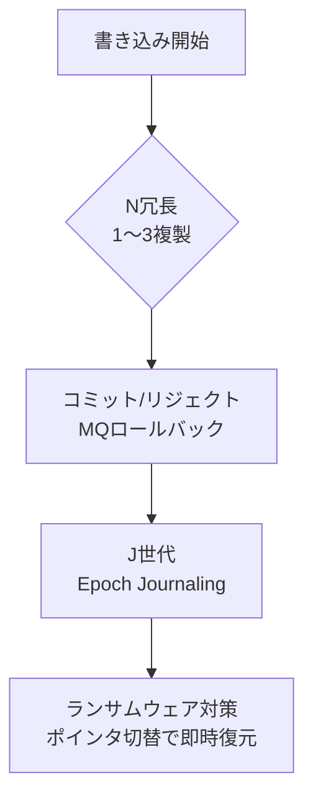
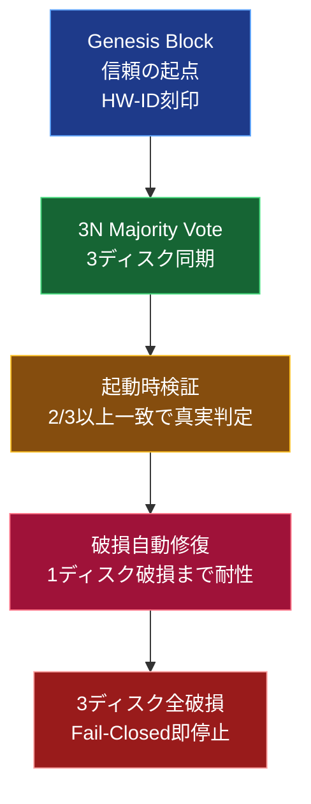
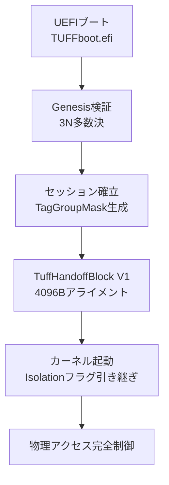

**TUFF-OS 詳細説明書（技術的説明書）**  
**最終版（視覚強化・Mermaid図完全挿入済み）**

---

## 1. アーキテクチャ概要

### 🚀 徹底的なZRAM圧縮アーキテクチャ (Sovereign ZRAM)
TUFF-OSは、GoogleのSnappy/LZ4アルゴリズムの思想をベアメタルレベルで統合しています。
システムメモリ（Sovereign Heap）の大部分を「インメモリ圧縮プール」として確保し、
Unique Queue (UQ)のデータやファイルシステムのキャッシュを透過的かつ超高速に圧縮・伸張します。
これにより、極端にメモリが少ない環境でも、実質的なメモリ容量を数倍に拡張し、
Vulkan GPUオフロードやPQC（耐量子暗号）の並列処理をリソース枯渇なしに実行し続けます。

TUFF-OSは、UEFIから直接システムを掌握し、ExitBootServicesを経てハードウェアを完全制御するPure RustベアメタルOSです。  
4階層ページテーブルとNX (No-Execute) ビットによる物理ハードウェアレベルのメモリ保護を強制し、論理的な脆弱性を排除し、**物理セクタ（LBA）への直接アクセス**と**数学的暗号（KEY-CSE）**を組み合わせることで、「絶対防衛圏」を構築します。

---

## 2. ストレージ・サブシステム詳細

### 2.1 ブロックデバイスとLBA拘束

アプリケーション層からは「JBOD（単一の巨大な仮想ドライブ）」として認識されますが、TUFF-OS内部では**各物理HDDのLBAを直接管理**しています。メタデータによる論理構造を持たないため、ファイルテーブルの改ざんや論理的フォレンジックが**物理的に不可能**です。

### 2.2 UQ (Unique Queue) と HWキューのメカニズム

- **UQ (単一キュー)**: アプリケーション層からの全ライト要求を受け止めるバッファ領域。ZRAM上でのデータ圧縮およびKEY-CSE暗号化が施されます。
- **背圧制御 (Backpressure)**: UQ領域が設定値（デフォルト80%）に達すると、アプリケーション層に対し安全にI/Oブロック信号を送信し、システムダウンを防ぎます。
- **HWキューとディスパッチ**: 暗号化済みのデータは、各物理HDDごとのHWキューに分配されます。最もI/O負荷の低いHDDが動的に選択され、ヘッドのシーク待ちを最小化するようシーケンシャルに書き込まれます。
- **リード優先制御**: リード要求が入った場合、進行中のライト処理を一時中断（Suspend）し、リードを優先させることでディスクの物理的損耗を防ぎます。

### 2.3 データ保護層 (N冗長 / J世代)

- **N冗長 (1〜3の複製)**: 物理ディスクを跨いでデータを複製します。トランザクション管理により、書き込み中の電源断時でもMessage Queue (MQ)を用いたロールバックが作動し、1ビットのデータロストも防ぎます。
- **J世代 (Epoch Journaling)**: 更新ごとに元のLBAを上書きせず、新しいエポックとして別LBAへ書き込みます。これにより、ランサムウェア等による暗号化攻撃を受けた場合でも、インデックスのポインタを切り替えるだけで**一瞬で過去の世代へ復元**可能です。

### 2.4 緊急避難領域 (Emergency Area) とリビルド

全HDD容量の10%（既定値）を避難領域として確保します。ディスク障害の兆候（SMARTエラー等）を検知した場合、該当ディスクのデータを他の健全なディスクの避難領域へバックグラウンドで退避させます。  
新品のHDDをホットアタッチすると、避難領域のデータが新HDDへ自動で再同期（Append）され、**無停止でのリビルド**が完了します。

---

## 3. 非同期ランタイムとメモリ管理

### 3.1 Sovereign Executive & Async Runtime

TUFF-Coreの非同期処理は、ハードウェアタイマー (IRQ0) 駆動の独自非同期エグゼキュータ (Sovereign Executive) と `SleepFuture` を用い、ホストOSに依存しない真のマルチタスクとOS Tickを実現します。タスクの起床はIRQから直接O(1)で処理され、極めて低いレイテンシを誇ります。これにより、コアは応答性を保ちながら、キューイングと writeback 層で大量処理をさばけます。

### 3.2 ZRAMとSIMD Zeroize

セッション情報や権限タグ（TagGroupMask）は全てZRAMに展開されます。Isolation（隔離）モードへの移行時やログアウト時には、**OSスケジューラによってネイティブ管理されるAVX/AVX-512ベクトル命令**を用いて、メモリ上の機密データをコンマ数ミリ秒で一括消去（Zeroize）します。

---

## 4. セキュリティとネットワーク防衛

### 4.1 物理デセプション (ChaCha20 Read Deception)

未認証状態のまま物理ディスクを直接読み取ろうとする行為に対し、LBA位相とハードウェアIDをシードとしたChaCha20ストリーム暗号による「一貫性のあるノイズ」を返却します。OS管理下のAVX/AVX-512ベクトル命令により、CPU負荷をかけずに無限のノイズを生成し続けます。

### 4.2 KEY-CSE 独自暗号

総鍵長768ビットの独自ストリーム暗号を採用しています。USBメモリ等の外部デバイスに格納された物理鍵と、ユーザーの認証トークンが揃わなければ復号は数学的に不可能です。

### 4.3 ネットワーク防衛網 (KAIRO-P)

- **ベアメタル・ネットワークスタックによるダイレクト監視**: OSに組み込まれたネイティブのパケットインスペクション層がNICから直接パケットを監視し、未承認ポートや不正な接続をOS到達前にSilent Drop（破棄）します。
- **ベアメタル Vulkan GPGPU オフロード (PCIe BARs 直接アクセス)**: 大規模なDDoS（SYN Flood等）やL7ペイロード解析（IDPI）をPCIe BARs経由でSovereign Command Ringからコンピュートシェーダを直接GPUへサブミットし、CPU使用率を限りなく0.0%に近づけながら攻撃を無効化します。
- **PQC（ポスト量子暗号）証跡**: 破棄したパケットのログは、ML-DSA系列の量子耐性署名によってハッシュチェーン化され、改ざん検知可能な証跡として保存されます。

---

## 5. ブートプロセスとハンドオフ

### 5.1 TuffHandoffBlock V1

UEFIフェーズで確立された認証セッションやセキュリティ状態は、4096バイトにアライメントされたHandoffブロックを通じてカーネルへ安全に引き継がれます。UEFI段階でIsolationが発動した場合、そのフラグも引き継がれ、OS起動後も物理的なアクセス遮断が継続します。
